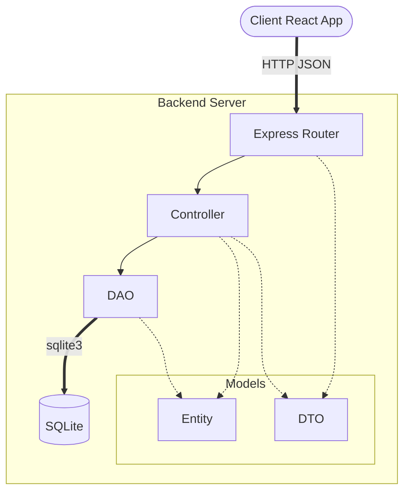

# Office-Queue-Management

# Backend

## Tech stack

| Package | Used for |
|---|---|
| `express` | HTTP server and REST routes |
| `cors` | Allows the frontend origin to call the API |
| `socket.io` | Real-time events between server and clients |
| `better-sqlite3` | SQLite database (synchronous driver) |
| `typescript` | Type checking and compilation (pinned to v6) |
| `tsx` | Runs TypeScript directly in development, with auto-restart |
| `oxlint` | Linting |
| `vitest` | Test runner |
| `supertest` | For E2E api testing |
| `socket.io-client` | Testing socket events |
| `@types/*` | Type definitions for Node, Express, cors, better-sqlite3 and supertest |

## Getting started

Requires Node 22 or newer.

```bash
cd backend
npm install
npm run dev
```

The server listens on `http://localhost:3000`.

## Scripts

| Command | Description |
|---|---|
| `npm run dev` | Start in development mode with auto-restart |
| `npm run build` | Compile to `dist/` |
| `npm start` | Run the compiled server |
| `npm run lint` | Lint with oxlint |
| `npm run typecheck` | Type-check without emitting files |
| `npm test` | Run tests once |
| `npm run test:watch` | Run tests in watch mode |

### Server Architecture



## API

### `GET /services`
Returns the list of available services.

**200 OK**
```json
[
  { "id": 0, "tag_name": "Shipping" },
  { "id": 1, "tag_name": "Accounts" }
]
```

### `POST /tickets`
Creates a new ticket for a service.

**Request**
```json
{ "service_id": 1 }
```

**200 OK**
```json
{ "id": 1 }
```

**404 Not Found** – the service does not exist
```json
{ "code": 404, "name": "NotFoundError", "message": "Service not found" }
```

# Frontend

## Tech stack

| Package | Used for |
|---|---|
| `react` | UI library |
| `vite` | Development server and bundler with HMR |
| `typescript` | Type checking and compilation (pinned to v6) |
| `oxlint` | Linting |

## Getting started

```bash
cd frontend
npm install
npm run dev
```

The application runs on `http://localhost:5173`.

## Scripts

| Command | Description |
|---|---|
| `npm run dev` | Start development server with HMR |
| `npm run build` | Type-check and compile production bundle |
| `npm run lint` | Lint with oxlint |
| `npm run preview` | Preview production build locally |

## Base Project Structure

```
src/
  main.tsx      React entry point
  App.tsx       Root application component
  App.css       Styles for App component
  index.css     Global styles
```
