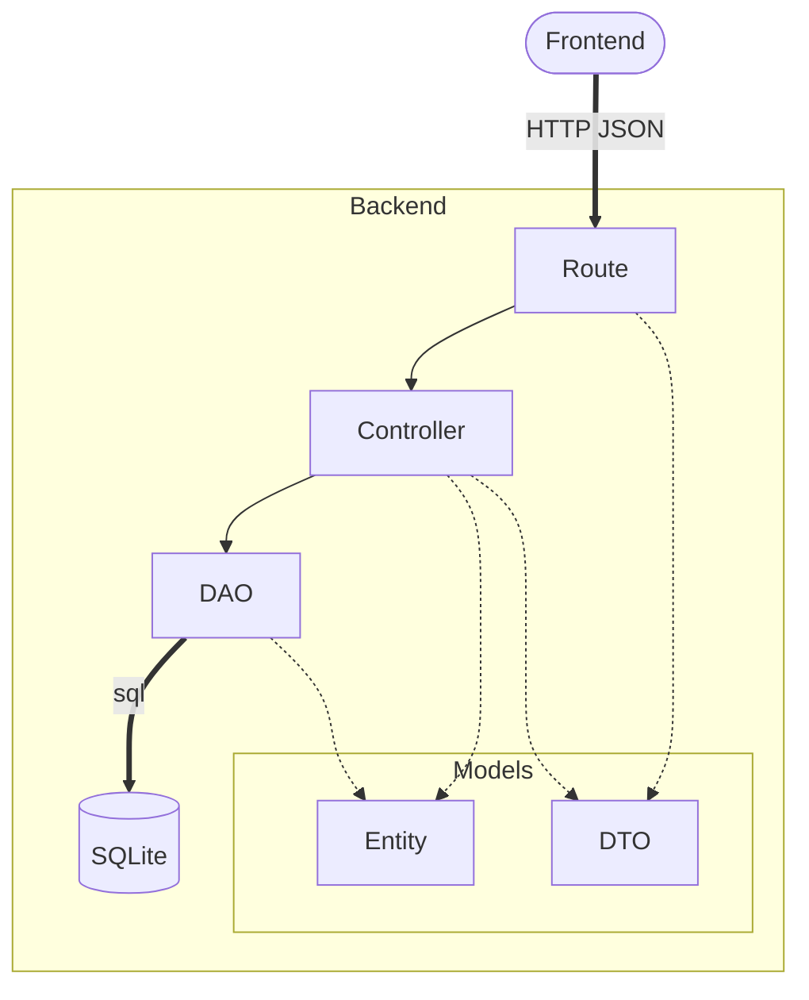

# Architecture

## Backend layers (`backend/src/`)

| Folder | Responsibility |
|---|---|
| `routes/` | Map each path to a controller; send the response or the error JSON |
| `controllers/` | Business logic and validation; throw `AppError` |
| `dao/` | SQL queries only; return entities |
| `models/entities/` | Shape of DB rows |
| `models/dto/` | Shape of API payloads |
| `models/errors/` | `AppError` and subclasses |
| `services/` | Helpers: entity → DTO mapping, error → response, authentication |
| `database/` | DB connection (`database.ts`) and SQL scripts (`sql/`) |
| `config/` | Configuration from environment variables |
| `tests/` | Vitest + Supertest tests |

## Rules

- Dependencies go one way: Route → Controller → DAO. 
- A DAO knows nothing about HTTP; a route never runs SQL.
- The API returns DTOs, never DB entities.
