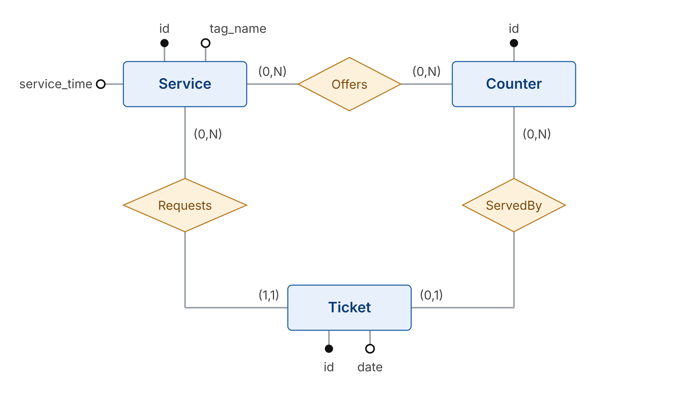
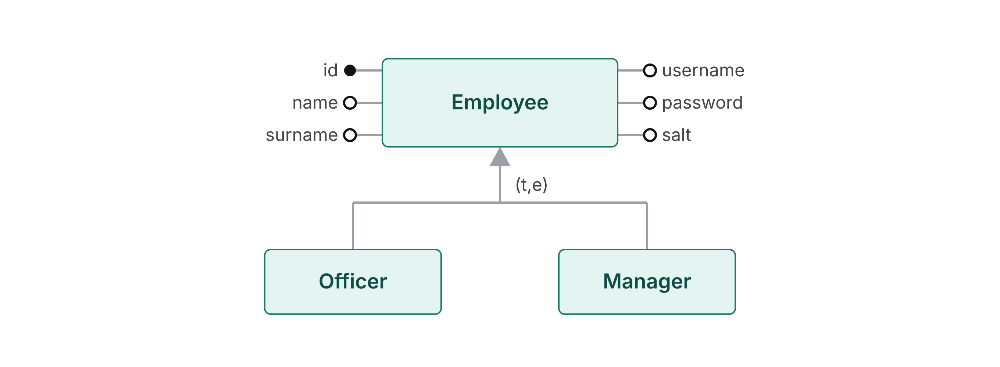

# Database

SQLite, accessed with `better-sqlite3`. The DB file path comes from the `DB_PATH` environment variable (default `backend/src/data/database.sqlite`).

## Conceptual schema

<!--  -->

## Logical schema

Primary keys in **bold**, `*` = nullable.

- Service(**id**, tag_name, service_time)
- Counter(**id**)
- Offers(**service_id** → Service, **counter_id** → Counter)
- Ticket(**id**, date, service_id → Service, counter_id\* → Counter)
<!-- - Employee(**id**, role, name, surname, username, password, salt) -->

## Rules not visible in the diagrams

- `ticket.id` is the ticket number given to the customer.
- `ticket.counter_id` is NULL while the ticket is waiting and is set to the counter that serves it.
- The queue of a service is today's tickets of that service with `counter_id` NULL.
- `ticket.date` is the **local** date `YYYY-MM-DD`. The format is enforced by a CHECK.
- In `ticket`, the composite FK `(service_id, counter_id) → offers` ensures a ticket can only be served by a counter that offers its service. It is checked only once `counter_id` is set: SQLite skips a composite FK when any of its columns is NULL, so waiting tickets are allowed.
- `PRAGMA foreign_keys = ON` must be run on every connection: SQLite disables FKs by default.
<!-- - Officer/Manager (total, exclusive) is mapped to a single `employee` table with a `role` column. -->
<!-- - `employee.password` is a scrypt hash with a per-user `salt` (see `backend/scripts/hash-password.ts`). -->

## SQL scripts (`backend/src/database/sql/`)

| File | Content |
|---|---|
| `init-core.sql` | Drops and recreates `service`, `counter`, `offers`, `ticket` |
| `seed-core.sql` | 3 services, 3 counters, their configuration, demo tickets (past days + today) |
<!-- | `init-auth.sql` | Drops and recreates `employee` | -->
<!-- | `seed-auth.sql` | 3 officers + 1 manager | -->

Run `init-*` before `seed-*`. The init scripts drop the tables: do not run them at every server start.
